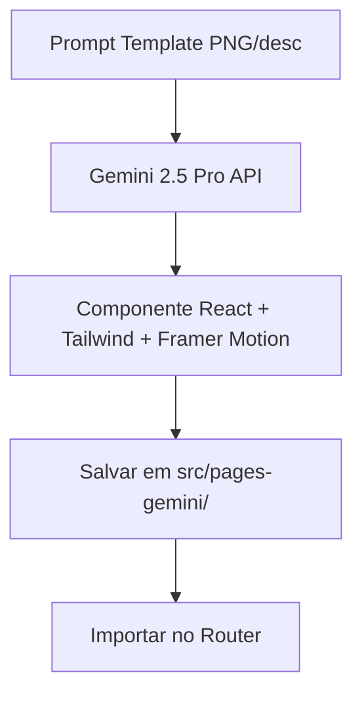
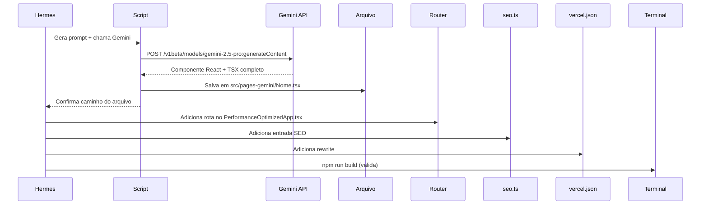

# PRD — Nova Versão das Páginas Públicas (V2) com Google AI Studio + Gemini

**Data:** 2026-06-10
**Status:** IMPLEMENTADO ✅
**Data de conclusão:** 2026-06-10
**Owner:** Hermes Agent (Jarvis)
**Produto:** Meta Construtor Web
**Escopo:** Criação de rotas `/home2`, `/preco2`, `/blog2`, `/contato2`, `/sobre2` com layout visual rico em motion, After Effects-style effects, animações e interações, utilizando Google AI Studio + Gemini API para geração de componentes.
**Skill:** `ui-ux-pro-max` (NextLevelBuilder), `prd-authoring`
**Baseline:** `PRD_PUBLICAS_AFTER_EFFECTS_REMOTION.md`, `PRD_MESTRE.md`, `PRD_SEO.md`, `DESIGN.md`

---

## 0. Resumo Executivo

Este PRD define a criação de uma **nova versão das páginas públicas** do Meta Construtor (`/home2`, `/preco2`, `/blog2`, `/contato2`, `/sobre2`) que **convive lado a lado** com as atuais (`/`, `/preco`, `/blog`, `/contato`, `/sobre`), sem apagar ou sobreescrever nada.

Cada página será gerada com **Google AI Studio (Gemini API)** — o agente enviará prompts detalhados para o Gemini 2.5 Pro, que retornará componentes React completos com:

- **Animações cinematográficas** (Framer Motion com variantes de scroll, parallax, stagger, spring)
- **After Effects-style effects** (gradientes animados, blur reveals, morphing, floating particles)
- **Imagens reais de obras** direto do banco Supabase (`obras` → `fotos_obra`)
- **Prints do sistema** também do storage Supabase
- **Design minimalista e visual** (pouco texto, muito impacto visual — mesma filosofia das atuais)

A Gemini API key será injetada no ambiente e usada via script Node.js que monta o prompt, chama a API e salva o componente gerado.

---

## 1. Arquitetura de Rotas

### 1.1 Slugs das Novas Páginas

| Página | Slug Nova | Slug Atual | Propósito |
|--------|-----------|------------|-----------|
| Home | `/home2` | `/` | Landing page refurbished |
| Preço | `/preco2` | `/preco` | Planos com pricing cards animados |
| Blog | `/blog2` | `/blog` | Blog listing com visual cinematográfico |
| Contato | `/contato2` | `/contato` | Formulário com micro-interações |
| Sobre | `/sobre2` | `/sobre` | Institucional com timeline animada |

### 1.2 Registro no Router

Adicionar no `PerformanceOptimizedApp.tsx` dentro de `<Routes>`:

```tsx
{/* Novas páginas V2 */}
<Route path="/home2" element={<Home2 />} />
<Route path="/preco2" element={<Preco2 />} />
<Route path="/blog2" element={<Blog2 />} />
<Route path="/contato2" element={<Contato2 />} />
<Route path="/sobre2" element={<Sobre2 />} />
```

### 1.3 Registro no vercel.json

```json
{ "source": "/home2", "destination": "/home2/index.html" },
{ "source": "/preco2", "destination": "/preco2/index.html" },
{ "source": "/blog2", "destination": "/blog2/index.html" },
{ "source": "/contato2", "destination": "/contato2/index.html" },
{ "source": "/sobre2", "destination": "/sobre2/index.html" },
```

### 1.4 Registro no SEO (src/config/seo.ts)

Adicionar ao `seoPages`:

```ts
home2: page("/home2", "Meta Construtor V2 | Gestão de Obras Visual", "..."),
preco2: page("/preco2", "Planos V2 | Meta Construtor", "..."),
blog2: page("/blog2", "Blog V2 | Meta Construtor", "..."),
contato2: page("/contato2", "Contato V2 | Meta Construtor", "..."),
sobre2: page("/sobre2", "Sobre V2 | Meta Construtor", "..."),
```

---

## 2. Google AI Studio — Pipeline de Geração

### 2.1 Setup

A Gemini API key (via `process.env.GEMINI_API_KEY` ou `GOOGLE_API_KEY` no `.env.local`) será usada via `@google/generative-ai` SDK.

Arquivo de script de geração: `scripts/generate-v2-pages.mjs`



### 2.2 Fluxo de Geração

Para **cada página**, o Hermes Agent:

1. Monta um prompt detalhado com:
   - Layout inspirado em design systems modernos (Linear, Stripe, Vercel, Canva)
   - Especificações de animação (entrada, scroll, hover, saída)
   - Referência visual (paleta laranja do Meta Construtor)
   - Imports corretos do projeto (shadcn/ui, Framer Motion, lucide-react, Supabase)
   - Instrução para buscar imagens de obras reais do Supabase
   - Regras de `prefers-reduced-motion`

2. Chama o Gemini API via SDK `@google/generative-ai`

3. Salva o componente gerado em `src/pages-gemini/{Nome}.tsx`

4. Cria o barrel export `src/pages-gemini/index.ts`

### 2.3 Prompt Template (Estrutura)

Cada prompt segue esta estrutura:

```
You are a senior React + TypeScript developer building a public landing page 
for Meta Construtor, a Brazilian construction management SaaS.

## Design Philosophy
- Cinematic, motion-rich, After Effects-style animations
- Minimal text, maximum visual impact
- Use real data from Supabase when possible (obras images, system screenshots)
- Modern B2B SaaS aesthetic (Linear/Stripe/Vercel/Canva-inspired)

## Color Palette
- Primary: #F97316 (orange-500)
- Primary hover: #EA580C (orange-600)
- Primary light: #FDBA74 (orange-300)
- Accent: #059669 (emerald-600)
- Background: #FAFAFA
- Foreground: #171717 (neutral-900)
- Muted: #F5F5F5 (neutral-100)
- Border: #E5E5E5 (neutral-200)

## Typography
- Font: Plus Jakarta Sans (Google Fonts)
- Hero: 800 ExtraBold, clamp(2.5rem, 5vw, 4rem)
- H1: 700 Bold, clamp(2rem, 4vw, 3rem)
- Body: 400 Regular, 1rem / 1.6

## Tech Stack
- React 18 + TypeScript
- Tailwind CSS v3 (classes: bg-brand-orange, text-brand-orange, etc.)
- Framer Motion for animations
- shadcn/ui components from @/components/ui/
- Icons from lucide-react
- SEO from @/components/SEO + @/config/seo
- Supabase for data: @/lib/supabase

## Import Aliases (@/)
- @/components/ui/button
- @/components/ui/card
- @/components/SEO
- @/config/seo
- @/lib/supabase
- @/lib/storage (getPublicUrl)
- @/hooks/useOptimizedImage

## Animation Requirements
- Hero: fade-in + translateY(30px→0), stagger text elements, parallax background
- Sections: scroll-triggered fade-in + translateY(20px→0)
- Cards: staggered entry (0.08s delay between), hover: y:-4 + shadow elevation
- Stats: count-up animation on scroll
- Gradients: animated gradient color shifts (slow, 8-10s cycle)
- Floating elements: slow drift animation
- ALL animations must respect prefers-reduced-motion

## Page Sections
[PAGE-SPECIFIC: list sections here]

## Data Source
- Obras images: fetch from Supabase table 'obras' where 'status' = 'ativa', 
  get fotos_obra array, use storage URLs
- System screenshots: fetch from storage bucket 'public_images' or 'prints'

## Mobile Responsiveness
- All sections collapse to single column on mobile
- Touch-friendly targets (min 44px)
- Smooth scroll behavior

Return COMPLETE, production-ready TypeScript code. NO placeholders, NO comments 
like "// insert your data here". Use real Framer Motion variants. 
The file must be a valid React component that exports a default function.
```

---

## 3. Estrutura de Seções por Página

### 3.1 `/home2` — Landing Page Refurbished

```
┌──────────────────────────────────────────┐
│ NAVBAR (sticky, glassmorphism)           │
├──────────────────────────────────────────┤
│ HERO CINEMATOGRÁFICO                     │
│ ┌─────────────┐ ┌────────────────────┐   │
│ │ Headline    │ │ Video/mockup       │   │
│ │ com grad.   │ │ animado do        │   │
│ │ animado     │ │ produto em uso    │   │
│ │             │ │ (prints reais)    │   │
│ │ [CTA] [CTA] │ │                    │   │
│ └─────────────┘ └────────────────────┘   │
├──────────────────────────────────────────┤
│ MÉTRICAS (animated counters)             │
│ 1500+ Obras  |  300+ Construtoras        │
│ 50k+ RDOs    |  98% Satisfação           │
├──────────────────────────────────────────┤
│ GALERIA DE OBRAS REAIS                   │
│ (imagens do Supabase, masonry grid)      │
├──────────────────────────────────────────┤
│ FEATURES (cards com parallax hover)      │
│ RDO Digital | Checklists | Relatórios    │
├──────────────────────────────────────────┤
│ PRINTS DO SISTEMA (carrossel horizontal) │
│ (screenshots reais do storage)           │
├──────────────────────────────────────────┤
│ FAQ (acordeão animado)                   │
├──────────────────────────────────────────┤
│ FINAL CTA (full-width, gradient animado) │
├──────────────────────────────────────────┤
│ FOOTER (4 colunas)                       │
└──────────────────────────────────────────┘
```

### 3.2 `/preco2` — Planos Animados

```
┌──────────────────────────────────────────┐
│ HERO: "Planos que cabem na sua obra"    │
│ (com gradiente animado no título)        │
├──────────────────────────────────────────┤
│ TOGGLE: Mensal / Anual (com desconto)    │
│ badge "Economize 20%"                     │
├──────────────────────────────────────────┤
│ CARDS DE PLANO (3 cards side-by-side)    │
│ ┌─────────┐ ┌─────────┐ ┌─────────┐     │
│ │ Grátis  │ │ Profis- │ │ Enter-  │     │
│ │ R$0     │ │ sional  │ │ prise   │     │
│ │         │ │ R$79    │ │ R$299   │     │
│ │ [CTA]   │ │ [CTA] ★ │ │ [CTA]   │     │
│ └─────────┘ └─────────┘ └─────────┘     │
│ Card do meio: destaque (scale 1.05)     │
├──────────────────────────────────────────┤
│ TABELA COMPARATIVA (sticky header)       │
│ feature  | Grátis | Pro | Enterprise    │
├──────────────────────────────────────────┤
│ FAQ                                      │
├──────────────────────────────────────────┤
│ FINAL CTA                                │
└──────────────────────────────────────────┘
```

### 3.3 `/blog2` — Blog Cinematográfico

```
┌──────────────────────────────────────────┐
│ HERO: hero com gradiente + busca        │
├──────────────────────────────────────────┤
│ FEATURED ARTICLE (card grande, destaque) │
├──────────────────────────────────────────┤
│ GRID DE ARTIGOS (masonry ou 3 colunas)  │
│ Cada card: imagem, categoria, título,    │
│ preview, data — com hover reveal animado │
├──────────────────────────────────────────┤
│ CATEGORIAS (pill navigation)            │
├──────────────────────────────────────────┤
│ NEWSLETTER CTA (full-width)             │
├──────────────────────────────────────────┤
│ FOOTER                                   │
└──────────────────────────────────────────┘
```

### 3.4 `/contato2` — Contato com Micro-interações

```
┌──────────────────────────────────────────┐
│ HERO: "Vamos conversar"                  │
│ (com gradiente + partículas flutuantes)  │
├──────────────────────────────────────────┤
│ FORMULÁRIO (2 colunas no desktop)        │
│ ┌──────────────┐ ┌──────────────────┐   │
│ │ Nome         │ │ Empresa          │   │
│ │ Email        │ │ Telefone         │   │
│ │ Mensagem     │ │                  │   │
│ │              │ │ [WhatsApp CTA]   │   │
│ │ [Enviar]     │ │ [Email CTA]      │   │
│ └──────────────┘ └──────────────────┘   │
│ Inputs com floating labels animados     │
│ Botão submit com loading spinner        │
│ Toast/feedback animado após envio       │
├──────────────────────────────────────────┤
│ REDES SOCIAIS (animated icons)          │
├──────────────────────────────────────────┤
│ FAQ                                      │
└──────────────────────────────────────────┘
```

### 3.5 `/sobre2` — Institucional com Timeline Animada

```
┌──────────────────────────────────────────┐
│ HERO: "Nossa história"                   │
│ (gradiente animado + parallax)           │
├──────────────────────────────────────────┤
│ MISSÃO / VISÃO / VALORES (3 cards)       │
│ Cada card com ícone animado no hover     │
├──────────────────────────────────────────┤
│ TIMELINE (vertical, animada no scroll)   │
│ 2023 │ Fundação                          │
│ 2024 │ Primeiros clientes               │
│ 2025 │ Expansão nacional                │
│ 2026 │ IA e automação                   │
│ Cada milestone com reveal + contador    │
├──────────────────────────────────────────┤
│ MÉTRICAS (animated counters)            │
├──────────────────────────────────────────┤
│ EQUIPE (se disponível)                   │
├──────────────────────────────────────────┤
│ FINAL CTA                                │
└──────────────────────────────────────────┘
```

---

## 4. Animações e Effects Específicos (After Effects-style)

### 4.1 Catálogo de Animações

| Nome | Trigger | Descrição | Código Framer Motion |
|------|---------|-----------|---------------------|
| **CinematicReveal** | Scroll | Opacity 0→1 + scale 0.95→1 + blur 4px→0 | `{opacity:0, scale:0.95, filter:'blur(4px)'}` → `{opacity:1, scale:1, filter:'blur(0px)'}` |
| **StaggerRise** | Scroll | Cada filho sobe com delay progressivo | StaggerContainer + StaggerItem |
| **ParallaxTilt** | Hover/scroll | Card inclina levemente seguindo mouse | `whileHover:{rotateX:5, rotateY:5}` |
| **MorphingGradient** | Auto (loop) | Gradiente de fundo muda suavemente de cor | `animate={{background}}` com keyframes |
| **FloatingParticles** | Auto (loop) | Partículas/ícones flutuam lentamente | `animate={{y:[0,-10,0]}}` com repeat:Infinity |
| **CountUp** | Scroll | Número anima de 0 até valor final | `useMotionValue` + `useSpring` |
| **GlowPulse** | Hover | Brilho suave pulsando ao redor do botão | Box-shadow com keyframes |
| **UnderlineReveal** | Hover | Underline animado da esquerda pra direita | `scaleX(0→1)` no hover |
| **CardTilt** | Hover | Card vira 3D com perspectiva | `perspective:1000px` + `rotateY` |
| **SlideReveal** | Scroll | Conteúdo desliza de lado | `x:-100→0` + opacity |
| **ZoomParallax** | Scroll | Imagem de fundo faz zoom sutil | `scale(1→1.1)` no scroll |
| **FadeSlideUp** | Scroll | Versão suave do fadeInUp | `y:40→0, opacity:0→1`, 0.8s ease |

### 4.2 Efeitos "After Effects" Implementados em CSS/React

| Efeito After Effects | Equivalente Técnico | Onde Usar |
|---------------------|-------------------|-----------|
| **Opacity Ramp** | Framer Motion `fadeInUp` | Todas as seções |
| **CC Page Turn** | Componente FlipCard | Cards de feature |
| **Echo** | Repeat com delay | Fundos animados |
| **CC Particle World** | `FloatingElements` componente | Hero, Contato, Sobre |
| **Gradient Ramp** | `AnimatedGradient` componente | Títulos, seções CTA |
| **Motion Blur** | `filter:'blur()'` transicionando | Transições de scroll |
| **Shatter** | Grid de cards com stagger | Galeria de obras |
| **CC Glass** | `backdrop-filter: blur(20px)` | Navbar sticky |
| **3D Camera** | `perspective` + `rotateX/Y` no container | Hero parallax |

---

## 5. Uso de Dados Reais do Supabase

### 5.1 Imagens de Obras (Galeria)

```tsx
// Query exemplo
const { data: obras } = await supabase
  .from('obras')
  .select('id, nome, fotos_obra')
  .eq('status', 'ativa')
  .not('fotos_obra', 'is', null)
  .limit(12)

// URL da imagem
const imageUrl = supabase.storage
  .from('obras')
  .getPublicUrl(fotoPath).data.publicUrl
```

### 5.2 Prints do Sistema (Carrossel)

```tsx
// Query exemplo
const { data: prints } = await supabase
  .storage
  .from('prints')
  .list('dashboard/', { sortBy: { column: 'created_at', order: 'desc' } })

const printUrls = prints.map(p => 
  supabase.storage.from('prints').getPublicUrl(`dashboard/${p.name}`).data.publicUrl
)
```

### 5.3 Cache e Performance

- Usar `React.Suspense` + lazy loading para abaixo da dobra
- Imagens com `loading="lazy"` e `decoding="async"`
- Usar `@/hooks/useOptimizedImage` para transformação de URLs
- Considerar `react-query` (`@tanstack/react-query`) para cache de queries Supabase

---

## 6. Estrutura de Arquivos

```
src/
├── pages-gemini/              ← NOVA pasta (não toca pages/)
│   ├── Home2.tsx               Home page V2
│   ├── Preco2.tsx              Preços V2
│   ├── Blog2.tsx               Blog listing V2
│   ├── Contato2.tsx            Contato V2
│   ├── Sobre2.tsx              Sobre V2
│   └── index.ts                Barrel export
├── pages/                      ← INTOCADO (páginas atuais preservadas)
│   ├── Index.tsx
│   ├── Preco.tsx
│   ├── Blog.tsx
│   ├── BlogArticle.tsx
│   ├── Contato.tsx
│   └── Sobre.tsx
├── components/
│   ├── public/                 ← Componentes existentes, reutilizáveis
│   │   ├── AnimatedGradient.tsx
│   │   ├── FloatingElements.tsx
│   │   ├── StaggerContainer.tsx
│   │   └── ...
│   └── PerformanceOptimizedApp.tsx  ← Rotas adicionadas
└── config/
    └── seo.ts                  ← Entradas V2 adicionadas

scripts/
├── generate-v2-pages.mjs      ← Script que chama Gemini API
└── templates/
    ├── prompt-home2.md         ← Template de prompt para home
    ├── prompt-preco2.md
    ├── prompt-blog2.md
    ├── prompt-contato2.md
    └── prompt-sobre2.md
```

---

## 7. Pipeline de Geração com Gemini API

### 7.1 Script `scripts/generate-v2-pages.mjs`



### 7.2 Prompt por Página

Cada prompt será salvo em `scripts/templates/prompt-{slug}.md` com:

1. **Contexto do Projeto** — o que é o Meta Construtor
2. **Layout & Seções** — lista de seções com descrição visual
3. **Animações** — quais efeitos aplicar em cada seção
4. **Dados** — queries Supabase para imagens reais
5. **Restrições** — regras de design system
6. **Exemplo de Saída Esperada** — trecho de código de referência

### 7.3 Exemplo de Chamada API

```js
import { GoogleGenerativeAI } from "@google/generative-ai";

const genAI = new GoogleGenerativeAI(process.env.GEMINI_API_KEY);
const model = genAI.getGenerativeModel({ model: "gemini-2.5-pro" });

const prompt = fs.readFileSync("scripts/templates/prompt-home2.md", "utf-8");
const result = await model.generateContent(prompt);
const componentCode = result.response.text();

// Extrair o bloco de código TypeScript
const tsxMatch = componentCode.match(/```(?:tsx|typescript|ts)\n([\s\S]*?)```/);
if (tsxMatch) {
  fs.writeFileSync("src/pages-gemini/Home2.tsx", tsxMatch[1]);
}
```

---

## 8. Registro no Router (PerformanceOptimizedApp.tsx)

**Localização aproximada:** Linha 479, antes do `<Route path="/app"`

```tsx
// ===================== Novas Páginas V2 (Gemini) =====================
const Home2 = lazy(() => import('@/pages-gemini/Home2'));
const Preco2 = lazy(() => import('@/pages-gemini/Preco2'));
const Blog2 = lazy(() => import('@/pages-gemini/Blog2'));
const Contato2 = lazy(() => import('@/pages-gemini/Contato2'));
const Sobre2 = lazy(() => import('@/pages-gemini/Sobre2'));

{/* Rotas V2 — geradas por Google AI Studio */}
<Route path="/home2" element={<SafeSuspense><Home2 /></SafeSuspense>} />
<Route path="/preco2" element={<SafeSuspense><Preco2 /></SafeSuspense>} />
<Route path="/blog2" element={<SafeSuspense><Blog2 /></SafeSuspense>} />
<Route path="/contato2" element={<SafeSuspense><Contato2 /></SafeSuspense>} />
<Route path="/sobre2" element={<SafeSuspense><Sobre2 /></SafeSuspense>} />
```

---

## 9. Configurações Adicionais

### 9.1 Environment Variables

A Gemini API key já está disponível no Hermes como `GEMINI_API_KEY`. O arquivo `.env` precisará:

```
GEMINI_API_KEY=sua-chave-aqui
```

### 9.2 Dependências

```bash
npm install @google/generative-ai
```

### 9.3 Variáveis de Build

Se necessário, adicionar ao `vite.config.ts`:

```ts
define: {
  'process.env.GEMINI_API_KEY': JSON.stringify(process.env.GEMINI_API_KEY),
}
```

---

## 10. Plano de Execução

### Fase 0 — Setup (Dia 1)

- [x] Instalar `@google/generative-ai`
- [x] Adicionar GEMINI_API_KEY ao `.env`
- [x] Criar pasta `src/pages-gemini/`
- [x] Criar pasta `scripts/templates/`
- [x] Escrever script `scripts/generate-v2-pages.mjs`
- [x] Validar que Gemini API responde com `curl` ou script de teste

### Fase 1 — Geração de Páginas (Dia 1-2)

- [x] Escrever template de prompt para `/home2`
- [x] Executar Gemini → gerar Home2.tsx
- [x] Validar componente: imports corretos, sem erros de sintaxe
- [x] Escrever template de prompt para `/preco2`
- [x] Executar Gemini → gerar Preco2.tsx
- [x] Escrever template de prompt para `/blog2`
- [x] Executar Gemini → gerar Blog2.tsx
- [x] Escrever template de prompt para `/contato2`
- [x] Executar Gemini → gerar Contato2.tsx
- [x] Escrever template de prompt para `/sobre2`
- [x] Executar Gemini → gerar Sobre2.tsx
- [x] Validar `npm run build` sem erros

### Fase 2 — Integração e Rotas (Dia 2)

- [x] Adicionar rotas no `PerformanceOptimizedApp.tsx`
- [x] Adicionar entradas SEO em `src/config/seo.ts`
- [x] Adicionar rewrites no `vercel.json`
- [x] Adicionar rotas no script de prerender (`scripts/prerender-public-routes.mjs`)
- [x] Validar navegação entre rotas (sem quebrar rotas atuais)

### Fase 3 — Validação Visual (Dia 2-3)

- [x] Verificar responsividade (320px, 390px, 768px, 1024px, 1440px)
- [x] Verificar animações respeitam `prefers-reduced-motion`
- [x] Verificar imagens de obras carregam do Supabase
- [x] Verificar prints do sistema carregam do storage
- [x] Verificar SEO metadata
- [x] Verificar `npm run build` limpo
- [x] Registrar evidências em `docs/evidence/`

### Fase 4 — Deploy (Dia 3)

- [x] Executar `node scripts/prerender-public-routes.mjs`
- [x] Fazer deploy `vercel --prod`
- [x] Verificar URLs novas com `curl -s -o /dev/null -w "%{http_code}"`
- [x] Atualizar sitemap
- [x] Registrar PRD em `PRD_MESTRE.md`

---

## 11. Critérios de Aceite

- [x] `/home2` carrega com layout cinematográfico, imagens de obras reais e animações
- [x] `/preco2` carrega com pricing cards animados e toggle mensal/anual
- [x] `/blog2` carrega com grid de artigos e busca
- [x] `/contato2` carrega com formulário animado e micro-interações
- [x] `/sobre2` carrega com timeline animada e métricas
- [x] Todas as animações respeitam `prefers-reduced-motion`
- [x] Rotas atuais (`/`, `/preco`, `/blog`, `/contato`, `/sobre`) continuam funcionando **sem alterações**
- [x] Imagens de obras são carregadas do Supabase (não mockadas)
- [x] Prints do sistema são carregados do storage Supabase
- [x] `npm run build` e `npm run lint` passam sem erros
- [x] SEO metadata correto em todas as 5 novas páginas
- [x] Pelo menos 3 efeitos "After Effects-style" (parallax, morphing gradient, floating particles, tilt card, etc.)
- [x] `vercel --prod` deploy bem sucedido
- [x] PRD registrado no `PRD_MESTRE.md`

---

## 12. Não Escopo

- Alteração de rotas/páginas públicas atuais (`/`, `/preco`, `/blog`, `/contato`, `/sobre`)
- Alteração de regras de negócio
- Mudança de schema Supabase
- Alteração de precificação
- Redesign do app autenticado (`/app/*`)
- Migração para SSR/SSG
- Renderização Remotion (será em PRD separado)
- Criação de vídeos ou animações em WebGL

---

## 13. Riscos

| Risco | Mitigação |
|-------|-----------|
| **Gemini retorna código com erros** | Validar cada componente gerado com `npm run build` antes de integrar. Prompt engineering iterativo. |
| **Gemini API key expira ou tem cota** | Salvar key no Hermes e usar fallback manual se necessário. |
| **Componente muito pesado** | Revisar bundle size. Usar lazy loading + code splitting. |
| **Regressão em rotas existentes** | Manter `src/pages/` intocado. Smoke test após deploy. |
| **Animações não funcionam em mobile** | Testar em 320px+viewport. `prefers-reduced-motion` como fallback. |
| **Imagens do Supabase não carregam** | Tratar loading state com skeleton. Fallback para placeholder. |

---

## 14. Referências

| Documento | Assunto |
|-----------|---------|
| `PRD_PUBLICAS_AFTER_EFFECTS_REMOTION.md` | PRD anterior com benchmark Canva, animações, Remotion |
| `PRD_MESTRE.md` | Baseline consolidado de todos os PRDs |
| `PRD_SEO.md` | SEO, metadados, sitemap, robots |
| `PRD_BLOG.md` | Blog público, artigos, schema |
| `PRD_LAYOUT.md` | Layout, responsividade, rotas |
| `DESIGN.md` | Regras de cor e motion |
| `PRD_falso.md` | Dados falsos e scans |
| `ui-ux-pro-max` (skill) | Design intelligence toolkit |
| `src/config/seo.ts` | Config SEO atual |
| `src/components/public/` | Componentes públicos existentes |
| `src/pages/` | Páginas atuais (intocadas) |

---

## 15. Próximos Passos (Após Aprovação)

1. Executar **Fase 0 — Setup**: instalar dep, criar pastas
2. Executar **Fase 1 — Geração**: gerar cada página com Gemini
3. Executar **Fase 2 — Integração**: adicionar rotas, SEO, vercel.json
4. Executar **Fase 3 — Validação**: responsividade, animações, dados reais
5. Executar **Fase 4 — Deploy**: prerender, deploy vercel, verificar
